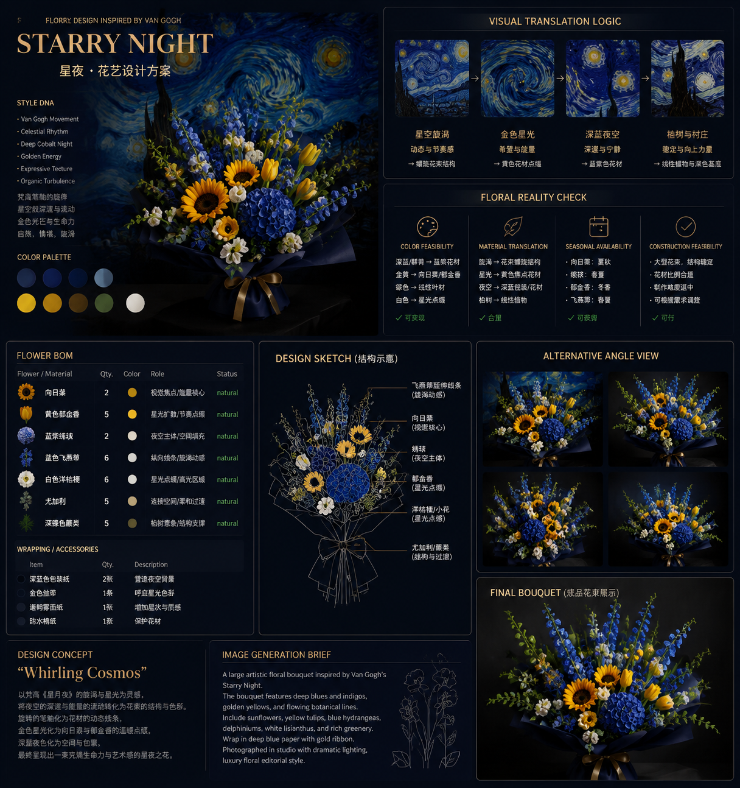
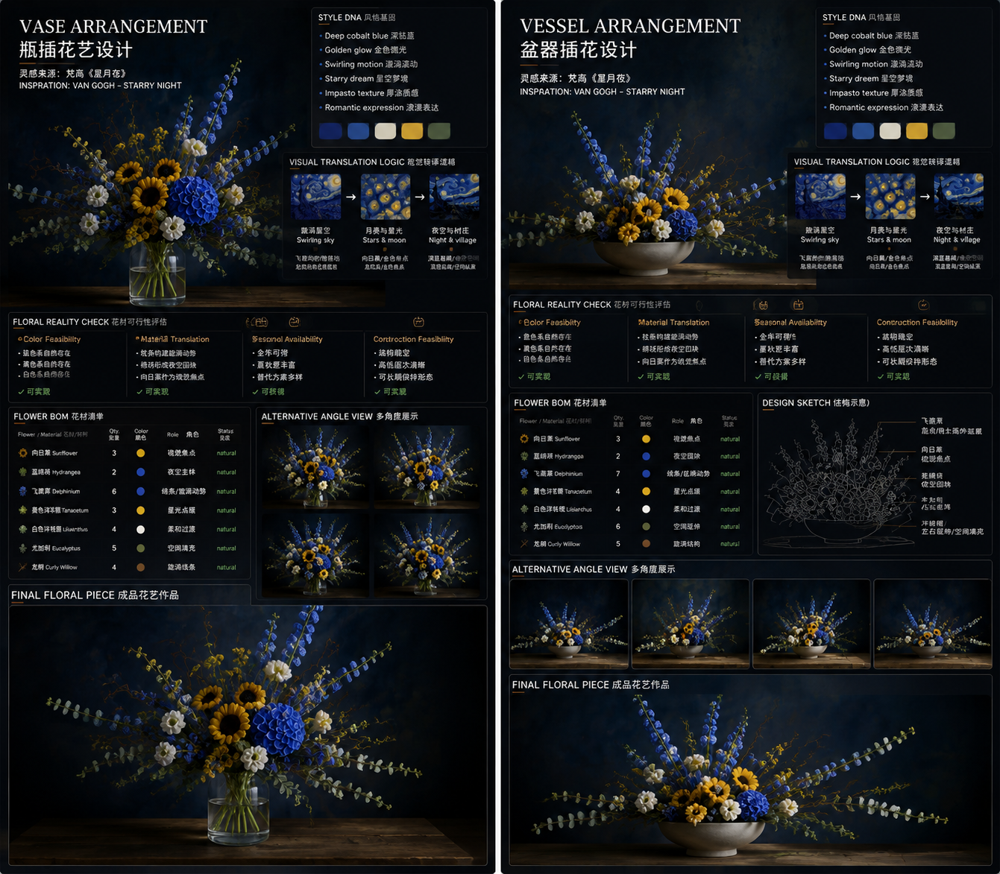

# Floral Art Director Skill

A reusable agent skill for translating the visual language of an album cover, painting, film still, photograph, illustration, or personal image into **professional, manufacturable floral artworks** — delivered as a complete design presentation package plus a realistic final floral piece (wrapped bouquet, vase arrangement, vessel arrangement, or floral installation).

## What is Floral Art Director

Floral Art Director is **not an image generator**. It is a design engine that inserts a real floristry layer between a reference image and a floral piece. Instead of copying what it sees, it reasons about what the image *means*, translates it through design language into floral language, decides the format the reference calls for — wrapped bouquet, vase arrangement, vessel arrangement, or floral installation — and builds a piece that could actually be made by a florist:

```text
Reference Image
    ↓
Visual Language Analysis
    ↓
Floral Translation
    ↓
Professional Floral Design
    ↓
Floral Format Selection
    ↓
Presentation Package
    ↓
Final Floral Piece Visualization
```

The output is a two-level **Floral Design Presentation Package**:

- **LEVEL 1 — Floral Design Board:** the design proposal, produced per format (Reference Analysis, Style DNA, Visual Translation Logic, Floral Design Concept, Floral Reality Check, Flower BOM, Design Sketch, Alternative Angle View).
- **LEVEL 2 — Final Floral Piece Visualization:** the selected format — wrapped bouquet, vase arrangement, vessel arrangement, or floral installation — as realistic product photography — no text, no labels, no diagrams.

Supports four floral formats — **Wrapped Bouquet / Vase Arrangement / Vessel Arrangement / Floral Installation** — and each selected format is delivered independently, never combined into one image.

The **BOM, not the generated image, is the source of truth for construction and procurement.**

## Output

The default output is a complete presentation package with **six deliverables**:

1. **Floral Format Decision** — the selected format(s) — Wrapped Bouquet / Vase Arrangement / Vessel Arrangement / Floral Installation — and the reason drawn from the reference's visual language, spatial relationships, emotional expression, and usage scenario
2. **Reference Analysis** — color structure, light and shadow, texture, composition, emotional atmosphere
3. **Style DNA** — 4–7 keywords that capture the reference's visual logic
4. **Visual Translation Logic + Floral Design Concept** — every image feature mapped through `visual element → design language → floral language`, plus piece name, philosophy, structure, and emotion
5. **Flower BOM** — procurement-level material table with exact quantities, colors, roles, flower status (`natural` / `dyed` / `preserved` / `decorative material`), and substitutes, plus Design Sketch and Alternative Angle View
6. **Final Floral Piece Visualization** — the LEVEL 2 product-photography image of each selected format (Final Bouquet, Vase Arrangement Final Render, Vessel Arrangement Final Render, or Installation Final Render)

> **Case study:** the *Starry Night* walkthrough in [examples/starry-night-example.md](examples/starry-night-example.md) shows the full pipeline on Vincent van Gogh's painting — cobalt night becomes deep-blue iris and navy wrapping, the cadmium moon becomes a concentrated yellow ranunculus cluster, and the swirl becomes curly-willow line work. The same reference is used as an adversarial input in [tests/presentation-package-test.md](tests/presentation-package-test.md), which checks that the default output is the full two-level presentation package.

## Presentation Structure

This skill generates not only bouquet concepts, but complete floral art direction presentations.

Every presentation opens with the **Floral Format Decision**, then delivers each selected format as its own independent board + render. Each board contains:

- **Style DNA** — 4–7 keywords that capture the reference's visual identity
- **Visual Translation Logic** — why the piece matches the reference (element → interpretation → floral translation)
- **Floral Reality Check** — color feasibility, material translation, seasonal availability, construction feasibility
- **Flower BOM** — procurement table with quantity, color, role, status, and substitute
- **Design Sketch** — florist-style structural sketch of the piece
- **Alternative Angle View** — multiple views of the piece (2×2: front / 45° / side / detail)
- **Final Floral Piece** — standalone commercial product image of the selected format

The **output structure is fixed; the visual theme adapts** to the reference — the presentation style follows the reference's mood, palette, era, and artistic language, and is never locked to one theme (see SKILL.md → Visual Theme Adaptation).

## Features

- **Visual Language Analysis** — analyzes color structure, brightness, saturation, light, texture, composition, and mood into 4–7 Style DNA keywords
- **Four floral formats** — Wrapped Bouquet / Vase Arrangement / Vessel Arrangement / Floral Installation; the AI auto-decides the format(s) from the reference's visual language, spatial relationships, emotional expression, and usage scenario, and each selected format gets its own board + final render, never combined into one image
- **Floral Translation** — maps image features (color, line, haze, mass, negative space, gloss) into floral language through a design-language step
- **Two-level presentation package** — an 8-part Floral Design Board (per selected format) plus a clean product-photography Final Floral Piece Visualization
- **Realistic BOM generation** — every item quantified with role, color, flower status, and substitutes
- **Feasibility checking** — real and sourceable material only; rare colors distributed across wrapping, foliage, and decoration before dyed flowers
- **Locked structure, adaptive theme** — every presentation contains the same seven fixed components while the visual style follows the reference, never a forced black/black-gold theme
- **Render brief** — the LEVEL 2 image brief is consistent with the BOM; the render is visualization only

## Design Philosophy

> **The floral piece must first exist as a real floral artwork, and then resemble the reference image.**

A direct image-to-image workflow often creates visually attractive but unrealistic flowers or colors. This skill inserts a floral-design layer between image analysis and rendering:

```text
Reference image
    ↓
Visual Language Analysis
    ↓
Floral Translation
    ↓
Floral Design Concept
    ↓
Floral Format Selection (Wrapped / Vase / Vessel / Installation)
    ↓
Floral Reality Check
    ↓
Flower BOM + Design Sketch
    ↓
Presentation Package (LEVEL 1 board + LEVEL 2 visualization, per format)
```

## Floral Reality Check

The system does not only generate beautiful images. It evaluates whether the floral piece can exist in reality.

Every design passes a mandatory **Floral Reality Check** before any flower is written into the BOM:

```text
Reference Image
    ↓
Visual Understanding
    ↓
Floral Reasoning
    ↓
Reality Validation
    ↓
Floral Design
```

Four checks are applied:

- **Color Feasibility** — every color is classified as a *natural flower color*, an *approximation* carried by material, or a labeled *dyed flower*. No invented varieties.
- **Material Translation** — visual effects are decomposed into `flower + material + lighting + composition`; translucency is never reduced to a flower color.
- **Seasonal Availability** — strongly seasonal flowers always carry a substitute matched to their floral role.
- **Construction Feasibility** — the piece is stable, proportionate, and buildable by a working florist.

## Image Generation Rules

- **Design board (LEVEL 1):** editorial floral design board — premium magazine layout, modular cards, bilingual titles (English main title + Chinese auxiliary title), botanical photography, design notes. The layout theme adapts to the reference (see SKILL.md → Presentation Board Style and Visual Theme Adaptation); dark elegant is the default but never the only possible style.
- **Final floral piece (LEVEL 2):** realistic product photography of the selected format — realistic flower texture, natural petals, physically possible piece, plain supportive container or wrapping, luxury florist catalog style.

Keep the two styles separate: the board communicates the design; the final image sells the piece.

## Example Gallery

Each visual case owns an independent namespace under `assets/images/…` and is documented by exactly one example page — a new reference is always added as a sibling case and never reuses or replaces another case's image.

### Starry Night / 星空漩涡

Van Gogh's painterly cobalt-and-yellow night sky translated into a real, buildable bouquet.



[View full case study](examples/03-starry-night.md)

### Starry Night — Vase & Vessel Formats

The same reference re-delivered independently in the Vase Arrangement and Vessel Arrangement formats (Floral Format Selection).



[View full case study](examples/03-starry-night.md)

### Amber Within / 琥珀之心

Conceptual photography (a monochrome eye with an amber pupil) translated into an asymmetric cinematic floral design.


[View full case study](examples/eye-amber-example.md)

## Repository structure

```text
.
├── SKILL.md                     # The skill definition (workflow + quality gate)
├── README.md
├── agents/
│   └── openai.yaml              # OpenAI Agent Skill configuration
├── assets/
│   ├── icon.svg
│   └── images/                  # Case showcase images — one namespace per case
│       ├── case_starry_night/        # Starry Night final bouquet
│       ├── case_arrangement_formats/ # Vase + Vessel format board (Starry Night)
│       └── case_eye_amber/           # Amber Within design board (eye case)
├── examples/                    # Example gallery — see README.md
│   ├── README.md
│   ├── 01-aquatic-mint.md
│   ├── 02-la-la-land.md
│   ├── 03-starry-night.md
│   ├── eye-amber-example.md     # Amber Within case study (monochrome eye)
│   └── starry-night-example.md  # v0.2 full pipeline case study (Starry Night)
└── tests/                       # Benchmark test suite — see README.md
    ├── README.md
    ├── 01-color-overfitting.md
    ├── 02-impossible-flower.md
    ├── 03-seasonal-flower.md
    ├── 04-minimal-style.md
    ├── 05-luxury-style.md
    ├── 06-floral-reality-check.md
    ├── presentation-package-test.md  # v0.2 presentation package test (Starry Night input)
    └── presentation-structure-test.md  # v0.3 presentation structure test (locked structure, adaptive theme)
```

## Suggested future extensions

- city-specific flower availability and pricing
- seasonality database
- florist substitutions by budget
- structured JSON output for web/API use
- interactive controls for realism, budget, piece size, dye tolerance, and decorative elements
- automated presentation-package renderer (design board → final floral piece image)
