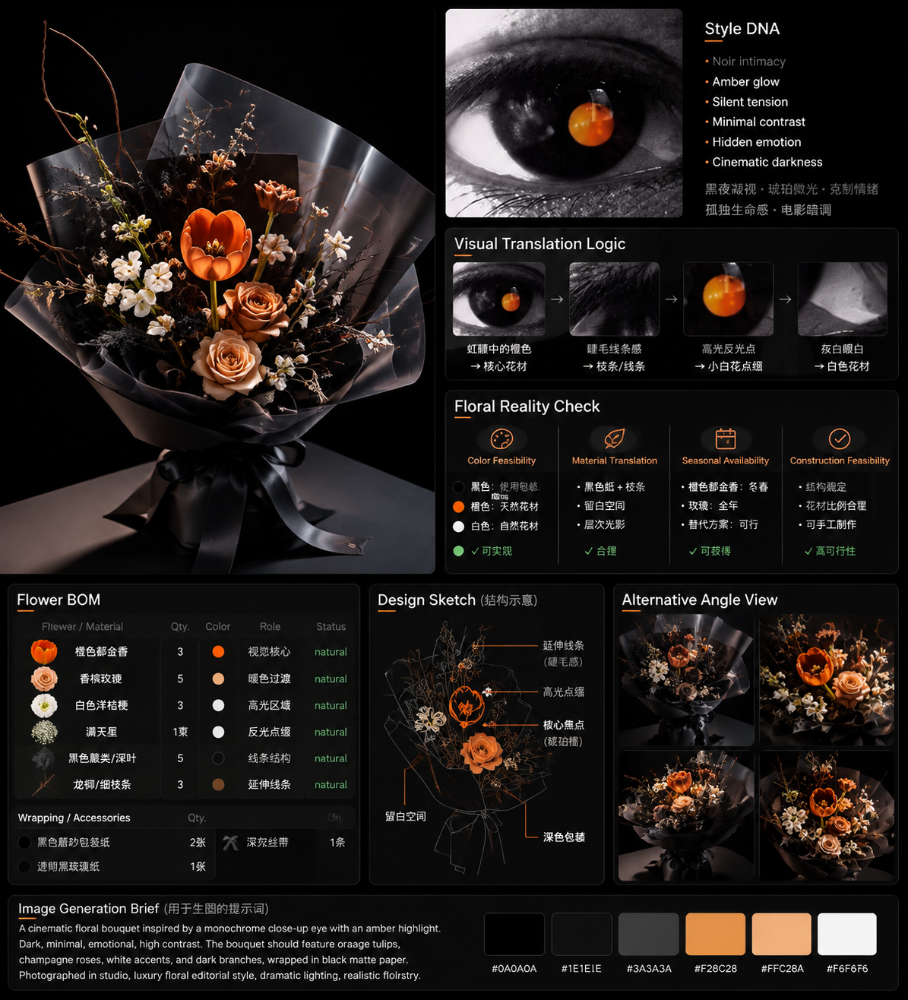

# Example 04 — Album Cover

A music album cover's visual language translated into a wrapped bouquet. This page shows the showcase render of the case produced by the skill.

> **Full design document** — the reference analysis, Style DNA, Floral Design Concept, Floral Reality Check, Flower BOM, and Image Generation Brief for this album cover follow in the same layout as Examples 01–03. They are filled in once the reference album artwork and its palette / mood / composition are specified.

## Final Bouquet Image

This image is the LEVEL 2 final render of the selected format — a standalone product photograph with no text, labels, or diagrams (per the skill's Image Generation Rules).
